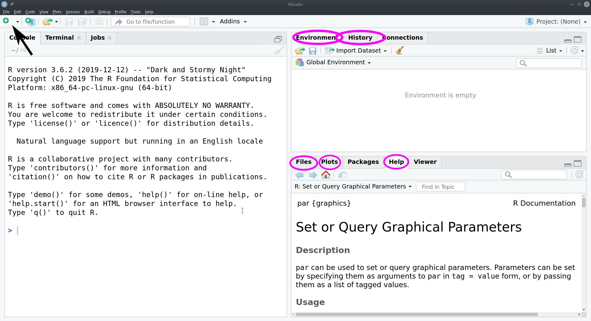
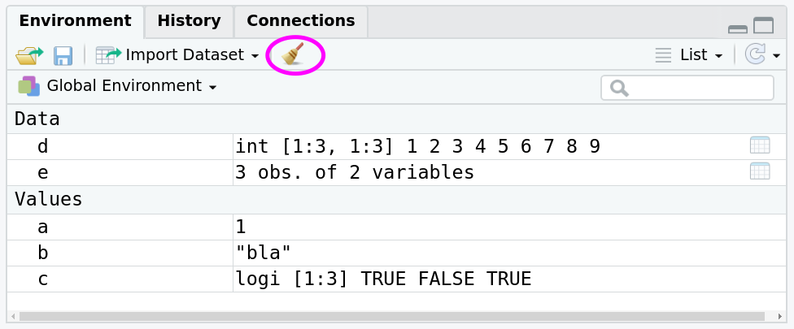
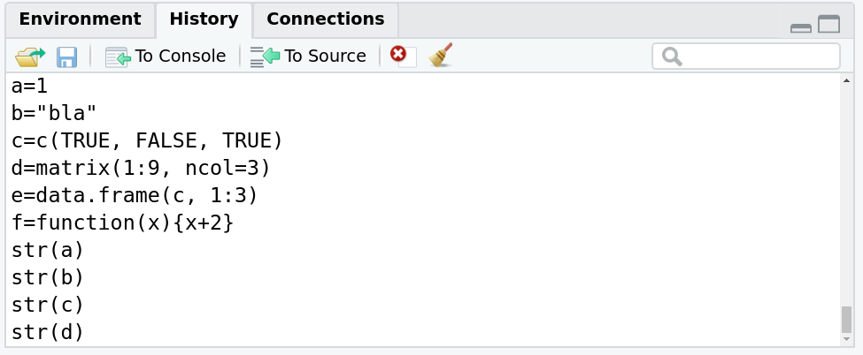
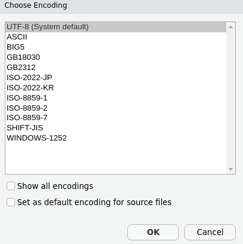

```{r setup, include=FALSE}
knitr::opts_chunk$set(echo = TRUE)
library(knitr)
library(data.tree)
library(plyr)
library(DiagrammeR)

hook_output <- knit_hooks$get("output")
knit_hooks$set(output = function(x, options) {
  lines <- options$output.lines
  if (is.null(lines)) {
    return(hook_output(x, options))  # pass to default hook
  }
  x <- unlist(strsplit(x, "\n"))
  more <- "..."
  if (length(lines)==1) {        # first n lines
    if (length(x) > lines) {
      # truncate the output, but add ....
      x <- c(head(x, lines), more)
    }
  } else {
    x <- c(more, x[lines], more)
  }
  # paste these lines together
  x <- paste(c(x, ""), collapse = "\n")
  hook_output(x, options)
})

```

# Matematikai alapok (1. óra)

A tárgy előfeltétele a *Matematika GY* tárgy, mely megad sok olyan matematikai alapkészséget, melyekre a hallgatóknak szükségük van. Vannak azonban a tárgynak nagy hiányosságai is. Sok ilyen hiányossággal nem tudnak a *Biostatisztika* tárgy oktatói foglalkozni, mivel nem áll rendelkezésükre megfelelő mennyiségű idő. Ezek közé tartozik a **deriválás** és **integrálás** is. Ezért csak kérhetem a motiváltabb hallgatókat, hogy nézzenek utána ezen fogalmak lényegének.  
Amivel foglalkozni tudunk, az két, az előadáson és gyakorlat során is gyakran használt operátor: a *szumma* és a *produktum*.

## A *szumma* operátor

Ha egy hosszabb számsorozat (pl. egy vektor) tagjainak az összegét akarjuk kiszámolni, felírhatjuk a megfelelő egyenletet a számsorozat tagjainak felsorolásával is, mint:
$$ x_1 + x_2 + x_3 + ... +x_n $$, a
ahol egy sorozat tagjait összeadjuk az első tagtól az *n*-edikig. A alsó indexbe tett számok a számsoroozat tagjait jelölik (*index*). A *szumma* ($\sum$) operátor azonban, erre egy sokkal egyszerűbb és kényelmesebb megoldást nyújt. A *szumma* operátor után következő kifejezés megadja az összeadandó produktum tagjait, míg az operátor alatt és felett sorra megadhatjuk egy új (az *index*) változó segítségével, hogy a számsorozat mely tagjait kívánjuk összeadni. Például az előző kifejezés a *szumma* operátor segítségével leírva így nézne ki:
$$ \sum_{i=1}^{n}{x_i} = x_1 + x_2 + x_3 + \dots +x_n $$
Itt az $x_i$ jelöli a számsorozat tagjait, az $i$ pedig az *index* változó, amit a *szumma* jel alatt és felett definiáltunk. A *szumma* jel alatt szoktuk definiálni az új változó kezdeti értékét, felette pedig az utolsó értékét. Itt például az $i$ 1-től $n$-ig fut: 1, 2, 3, ..., $n$. Tegyük fel, hogy $x$ egy vektor:

\begin{equation}
x =
\begin{pmatrix} 
10 \\ 
20 \\
30 \\
\vdots \\
90
\end{pmatrix}
\end{equation}

Ekkor az egyenletünket így számolhatjuk ki ($x$ első tagja 10, a második 20, és így tovább):

$$ \sum_{i=1}^{n}{x_i} = x_1 + x_2 + x_3 + ... +x_n = 10+20+30+\dots + 90 = 450 $$

Ha nincs semmi a *szumma* operátor alá és fölé írva, akkor az összes tagot összeadjuk. Ebben az esetben

$$ \sum{x_i} = \sum_{i=1}^{n}{x_i} $$

Ha csak a második és a harmadik tag összegét akarjuk kiszámolni, azt így tehetjük meg:

$$ \sum_{i=2}^{3}{x_i} = x_2 + x_3 = 20+30 = 50 $$

Tehetünk bonyolultabb tagokat is a *szumma* jel után. Például az előző vektor elemeinek négyzetösszege (az elemeit négyzetükre emeljük és ennek összegét vesszük):

$$ \sum_{i=1}^{n}{x_i^2} = x_1^2 + x_2^2 + x_3^2 + ... +x_n^2 = 10^2+20^2+30^2+\dots + 90^2 = 28500 $$

Nem csak előre megadott sorozatokra lehet alkalmazni a *szumma* operátort:

$$ \sum_{i=1}^{5}{i} = 1 +2 +3+4+5=15$$
Itt az $i$ index értékei voltak az összeadandó tagok, amit az operátoron belül definiáltuk.
Egy bonyolultabb példa: 

$$ \sum_{j=1}^{3}{(10^i+1)} = (10^1+1)+(10^2+1)+(10^3+1)=11+101+1001= 1113$$
Ha az $i$ index helyébe először behelyettesítünk 1-et, akkor $10^1+1$-et kapunk, ha 2-őt, akkor $10^2+1$-et, stb. és aztán ezeket mind összeadjuk.
Az előbbi egyenletet át is alakíthatjuk:

$$ \sum_{j=1}^{3}{(10^i+1)} = \sum_{j=1}^{3}{10^i} + \sum_{j=1}^{3}{1}=\sum_{j=1}^{3}{10^i} + 3 = \\ = 10+100+1000+3=1113 $$
Az összegből először kiemeljük az $i$-t tartalmazó tagokat, így kapjuk a két *szummás* tagot, melyből a második egy konstans szám (1) háromszori összeadása követkzik (amit elég könnyen kiszámíthatunk). Ugyanennél az egyenletnél ez felesleges rendezgetésnek tűnhet, de később még hasznos lesz a gyakorlat során.  
Egy másik átrendezős példa:

$$\sum_{i=2}^{4}{i/3} = 2/3+3/3+4/3= 0.667 + 1.000 + 1.333 = 3$$
A gyakorlottabbak a bonyolult tizedes törtekkel való dolgozás helyett így is megoldható:

$$\sum_{i=2}^{4}{i/3} = 2/3+3/3+4/3 = \frac{1}{3}(2+3+4)= {2+3+4 \over 3} = {9 \over 3} =3 $$,
egy számítógép azonban  nem fog nekiállni átrendezni az egyenleteinket, hanem egyesével kiszámolja a tagokat és összeadja, így kettővel több osztási műveletet végezne el, mint ami feltétlenül szükséges. Így érdemes formailag is átrendezni az egyenletet:

$$\sum_{i=2}^{4}{i/3} = \sum_{i=2}^{4}{1 \over 3}{i} ={1 \over 3} \sum_{i=2}^{4}{i}  ={\sum_{i=2}^{4}{i} \over 3} = {2+3+4 \over 3} =3 $$

A *szumma* műveleteket egymásba is ágyazhatjuk, tehát a külső operátort egy belső operátorra alkalmazzuk:

$$\sum_{a=0}^{2}{ \sum_{b=10}^{12}{b^a} } = \sum_{a=0}^{2}{ (10^a + 11^a +12^a) } = $$
$$ = (10^0 + 11^0 +12^0) + (10^1 + 11^1 +12^1) + (10^2 + 11^2 +12^2)= $$ 
$$ = 1+1+1+10+11+12+100+121+144 = 401$$
Ilyen esetekben először vesszük a külső *szumma* első értékét (ami itt $a=0$), majd elvégezzük a belső *szumma* operátor alapján az összeadást, amit a $b=0$ értékkel kezdünk (azaz $10^0 + 11^0 +12^0$). Majd vesszük $a=1$ értéket, és elvégezzük vele a belső operátor alapján az összeadást újra (eredmény: $10^1 + 11^1 +12^1$), és ezt az összeget hozzáadjuk az előző eredményekhez (eddig: $10^0 + 11^0 +12^0 + 10^1 + 11^1 +12^1$). Ezt folytatjuk mindaddíg, amíg tart a külső operátor számlálója, vagyis $a = 2$-ig.

## A *produktum* operátor

A *produktum* operátor ($\prod{}$) hasonlít a *szumma* operátorhoz azzal a kivétellel, hogy a tagokat nem összeadni kell, hanem összeszorozni. Így:

$$ \prod_{i=1}^{10}{i} = 1*2*3* \dots *10= 3628800$$

Eggyel bonyolultabb művelet:

$$ \prod_{i=-1}^{2}{2^i}=(2^{-1})*(2^0)*(2^1)*(2^2)=0.5*1*2*4=4$$

# Szükséges **R** alapok (1. óra)

## Miért **R**?

A gyakorlat során a statisztikai számításokat kézzel és az **R** statisztikai programcsomag segítségével fogjuk elvégezni. Az **R** használata mellett több érvünk is van:

 * ingyenes
 * konzolos (szöveges vagy másnéven *script*) alapú felület
 * az egyik leggyakrabban használt statisztikai program a biológiában
 * erős támogatottság, hatalmas közösség
 * platform független (bár alapvetően linux-ra lett fejlesztve)
 * *package*-ekkel bővíthető, konkrétan bármilyen számítástechnikai feladat elvégzésére képes
 * megbízható és pontos
 * viszonylag könnyen kezelhető
 * programozni is lehet benne (az órán erre nem lesz szükség!)
 * biológusok által leggyakrabban használt 
 * ELTE biológus hallgatók más kurzusokon is találkozni fognak vele

A hallgatóknak leggyakrabban az **R** konzol alapú írányításával van gondja, azonban oktatási tapasztalataink szerint a kezdeti nehézségek után sokkal könnyebben tanulható, mint a grafikus kezelőfelületű programok "most ide kattints - majd oda kattints" stílusú kezelése. Valamint így sokkal könnyebben ellenőrizhető a hallgatók tudásának mélysége is.  

## Az **RStudio** használata

Az **R** használatát nagyban megkönnyíti az **RStudio** nevű program, ami egy grafikus kezelőfelüleletet nyújt az **R** kezeléséhez.  
Az **R** és az **RStudio** feltelepítéséhez ebben a segédanyagban nincs útmutatás!  



Az **RStudio**-ban alapvetően két helyre írhatunk parancsokat: a megnyitott script fájlunkba és a *Console*ba (Fig. \ref{rst2}). 
Új script fájlt megnyitni a *"File -> New file -> R script"* útvonalon, a bal felső sarokban lévő ikon segítségével, vagy a *"CTR + SHIFT + N"* billentyűkombinációval lehet (lásd: Fig. \ref{rst1}).  


Ha meg van nyitva egy script fájl, akkor az **RStudio** felülete négy panelből áll (Fig \ref{rst2}). A bal felső panelban találjuk a megnyitott script fájlokat. Ezek egyszerű szövegfájlok, amikbe írhatjuk, szerkeszthetjük az **R** parancsokat. A script fájlokban található parancsok egyszerre történő lefuttatásához a panel jobb felső sarokában lévő *"Source"* gombot kell megnyomni, vagy a *"CTRL + SHIFT + ENTER"* billentyűkombinációt.

Az **R** egy interpreter nyelv, tehát a parancsokat egyesével is futtathatjuk, nem csak egyszerre az összeset (Iterpreter programozó nyelv: sorrol sorra haladva értékeli ki, és az eredményt azonnal kiszámolja, megjeleníti.). Egy parancs külön lefuttatásához a panel jobb felső sarkában lévő *"Run"* gombot, vagy a *"CTRL + ENTER"* billentyűkombinációt kell leütni. Ez egyszerre csak egy sort fog kiértékelni/lefuttatni, ezt fogjuk  a gyakorlatok során a legtöbbször alkalmazni. Ha több parancsot szeretnénk egyszerre lefuttatni, de nem az egész script fájl tartalmát, akkor jelöljük ki azt a lefuttatni szándékozott parancsokat tartalmazó szövegrészt, majd nyomjuk le a *"Run"* gombot.

A script fájlokat a *"File -> Save As..."* útvonalon tudjuk menteni, vagy a *"CTRL + S"* billentyűkombinációval. Az **R** scriptek általánosan használt kiterjesztése (a fájlnév pont utáni része) a .R  vagy .r (például: *myScriptFile.R*).

Alapértelmezés szerint bal oldalon, vagy a bal alsó sarokban találhatjuk a *Console* panelt. A *Console* valójában az **R** igazi kezelőfelülete, az **RStudio** ide másolja be és futtatja a script fájlból a futtatandó sorokat a *"RUN"* (és az összes fent említett) gomb hatására. Ide közvetlenül is írgatunk parancsokat, melyeket az *ENTER* gomb menyomásával futtathatunk. Érdemes megjegyezni, hogy innen a már lefuttatott parancsok visszakereshetők és újra lefuttathatók a *felfele* gomb megnyomásával (ahogy az megszokott Linux konzol és Windows cmd környezetekben).  



A jobb felső panelban találhatjuk az *Environment* és *History* paneleket. Az *Environment* kilistázza az **R** környezet változóit (Fig. \ref{rst_env}). Ugyancsak itt tudjuk kiüríteni a környezetet a "seprű" gomb segítségével. Erre akkor lehet majd szükség, ha belekavarodtunk a változóneveinkbe és újra akarjuk futtatni a parancsainkat. A *History* panelből visszakereshetjük a korábban kiadott parancsainkat (Fig. \ref{rst_hist}).  



A jobb alsó sarokban további fontos panelek találhatók. A *Files* fülön egy kezdetleges fájlböngészőt kapunk. A *Packages* fül segítségével kezelhetjük az **R** kiterjesztéseiként működő csomagokat, melyekkel újabb funkciókkal bővíthetjük ki az **R** repertoárját. A *Help* fül az egyik leggyakrabban használt fül, itt nézhetünk utána a különböző parancsok leírásának (Fig. \ref{rst2}). A *Plots* fülön pedig az ábráink fognak megjelenni.

## **R** alapok

### Változótípusok

Az **R**-t legegyszerűbben úgy képzelhetjük el, mint egy túlbonyolított számológépet. Amit minden számológépnek tudnia kell, azok a számokkal történő egyszerű és bonyolult műveletek. Írjuk bea script fájlba egy egész számot és futtaslu mint egy parancs tartalmaz:

```{r}
-13
```

Az **R** értelmezte a beírt sort és mivel csak egy számot tartalmazott, vissza is adta nekünk. A szám elé került [1] azt jelenti, hogy ennek a parancsnak csak egy visszatérési értéke volt és az pedig a szám maga. De az **R**, mint a számológépek is, tud kezelni törtszámokat is:

```{r}
0.0069
```

A számokat megadhatjuk normálalak formájában is. A normálalak matematikai definíció szerint (ettől el lehet térni) egy szorzat mely egy 0 és 10 közötti tényezőből és egy 10 hatványaként megadott tényezőből áll.

$$ 0.006 = 6*10^{-3} = 6e-3 $$
Ebben az esetben a $6$ a 0 és 10 közti tényező, míg a $10^{-3}$ a hatványtényező. Ezt az alakot rövidíthetjük úgy is, hogy az első tényező után egy $e$ karaktert rakunk majd utána a 10 hatványkitevőjét. Az **R** ezt a formátumot is felismeri:

```{r}
6e-3
```

**A gyakorlat során gyakran találkozunk majd normálalakba írt eredményekkel, így fontos, hogy figyeljünk rá és ismerjük fel!**  

A legtöbb programnyelv két fő számtípust különít el: az egész számokat (*integer*, gyakran *int*-ként jelölve) és valós számokat (*float* vagy *number*, gyakran *num*-ként jelölve). Az **R** alapból minden számot valós számként kezel, de ha valaki memória spórolás céljából egész számokat szeretne használni, azt a szám után írt *L* karakterrel jelezheti az **R**-nek. 

```{r}
56L
```

Az **R** képes komplex számokat is kezelni, de a gyakorlat során erre nem lesz szükségünk.  

Használhatunk még szöveget is. Szöveg vagy karakter használatakor mindig idézőjelbe kell tenni! Az idézőjel lehet 'egyszeres' vagy "kétszeres" is.

```{r}
"szoveg"
```

Az utolsó típus amivel találkozni fogunk a logikai érték. Logikai érték kétféle lehet: **igaz (igen)** vagy **hamis (nem)**. Az **R**-ben az igazt **TRUE**-val vagy egyszerű **T**-vel jelöljük, míg a hamist **FALSE**-al, vagy **F**-el (mindig nagybetű!) \emph{Megjegyzés}. Az egybetűs kódok nagyon zavaróak lehetnek, ha hasonló egybetűs változókat definiálunk. 

```{r}
TRUE
```

### Operátorok

A számológépekben, mint az **R**-ben is az értékekkel műveleteket végezhetünk el. Elvégezhetünk például alap matematikai műveleteket:

```{r}
4.5 + 8
```

```{r}
-2e2 - 36.2
```

```{r}
5 * 8
```

```{r}
-26 / 3
```

Az **R** kiértékelte a parancsokat, így a műveletek eredménye a kimeneti érték. Hatványozni a **^** jel segítségével lehet:

```{r}
2^5
```

Lehet használni kerek zárójeleket is a műveletek sorrendjének meghatározásához:

```{r}
2 * 5 + 6 / 2
```

```{r}
2 * (5 + 6) / 2
```

```{r}
((2 * 5) + 6) / 2
```

Az **R**-ben logikai operátorokat is használhatunk:

| kérdés | operátor |
|--------|----------|
| egyenlő-e? | == |
| nem egyenlő? | != |
| kisebb? | < |
| nagyobb? | > |
| kisebb vagy egyenlő? | <= |
| nagyobb vagy egyenlő? | >= |
| eleme-e halmaznak? | %in% |

Ezeknek a visszatérési értéke logikai érték lesz. Például:

```{r}
5 < 3
```

```{r}
"szoveg1" != "szoveg2"
```

A logikai értékekkel mindig elvégezhető a *NEM* operátor (**R**-ben jelölése: **!**). Ez az igaz értékekből hamisat, a hamis értékekből igazat csinál.

\begin{center}
\begin{tabular}{ |c||c|c|}
\hline
 & \textbf{TRUE} & \textbf{FALSE} \\
\hline
\hline
\textbf{!} & FALSE & TRUE \\
\hline
\end{tabular}
\end{center}

Például:
```{r}
!TRUE
```

Vagy alkalmazható egyéb műveletekre is:

```{r}
!(5 < 3)
```

Itt ugye az öt még mindig kisebb a háromnál, tehát a *5 < 3* kifejezés eredménye még mindig *FALSE*, de erre alkamlazva lett egy *!* operátor, így kaptuk a *TRUE*-t.

Ha több logikai értékünk van, használhatjuk a *vagy* (**R**-ben jelölése: **|**), illetve az és (**R**-ben jelölése: **&**) operátorokat.

\begin{center}
\begin{tabular}{ |c||c|c|}
\hline
\textbf{|} & \textbf{TRUE} & \textbf{FALSE} \\
\hline
\hline
\textbf{TRUE} & TRUE & TRUE \\
\hline
\textbf{FALSE} & TRUE & FALSE \\
\hline
\end{tabular}
\end{center}

```{r}
TRUE | FALSE
```

\begin{center}
\begin{tabular}{ |c||c|c|}
\hline
\textbf{\&} & \textbf{TRUE} & \textbf{FALSE} \\
\hline
\hline
\textbf{TRUE} & TRUE & FALSE \\
\hline
\textbf{FALSE} & FALSE & FALSE \\
\hline
\end{tabular}
\end{center}

```{r}
TRUE & FALSE
```

Hasznos tudni, hogy logikai értékekre alkalmazhatunk matematikai műveleteket. Például összeadásnál a *TRUE* értékek számát kapjuk vissza:

```{r}
TRUE + FALSE + TRUE
```

Mindezt azért tehetjük meg, merta  *TRUE* értéknek az *1*, a *FALSE* értékenek a *0* felel meg. Így válik érthetővé a következő példa erdménye is

```{r}
TRUE * FALSE + TRUE
```

Van az **R**-ben egy érdekes érték is: az **NA**. Ez azt jelöli, hogy nem áll rendelkezésünkre az adott adat. Ez fontos lesz bizonyos statisztikai számításoknál, amikor szeretnénk jelölni, hogy van valami, aminek ez értékét nem tudjuk, mert megsemmisült az adott mérés vagy valami más ok miatt. Az **NA**-val végzett műveletek eredménye többnyire **NA** lesz.

```{r}
NA + 3
```

### Változók

A matematikában nem csak számokat használunk értékek jelzésére, hanem néha karaktereket is, amiket változóknak hívnunk. Az **R**-ben is van lehetőség értékeket elmenteni változókba. A változókat változónevekkel jelöljük és a nevekhez az értékeket a **<-** (*nyíl operátor*) vagy az **=** jellel adjuk hozzá. Hivatolosan **R** kódokban a változók definiálásakor a **<-**jelet használják. Mentsünk el egy számot az **R**-ben egy változóba!

```{r}
a <- 54.2
```

Most hívjuk elő a változó értékét!

```{r}
a
```

Visszakaptuk az értéket, csakúgy, mintha magát a számot írtuk volna be. Ettől kezdve a változóval ugyanúgy lehet matematikai műveleteket végezni, mint számokkal.

```{r}
a + 1
```

A változókban az a jó, hogy értéküket felül is írhatjuk!

```{r}
a <- a + 1
a
```

Most a változót egyszerre felhasználtuk mint az összeadás egyik tagja, utána pedig az értékét felülírtuk az összeadás eredményével.

Miért hasznos eltárolni az értékeket egy változóban? Egyrészt ezután nem kell visszakeresgélni, hogy mennyi volt egy művelet (akár bonyolult) eredménye, hanem egyből használható is lesz a változóban eltárolva. Másrészt így írhatunk olyan kódokat, amiket később újra felhasználhatunk más kiindulási adatokra is.

A változónevek mindig betűvel kezdődnek, nincs bennük szóköz és nincs bennük speciális karakter (de **.** vagy **_** lehet)!

### Függvények

Az **R**-ben definiálhatunk függvényeket is. Ezek egyfajta műveletelet határoznak meg, amiket a beadott értékekkel/értékeken hajt végre, pont úgy hogyan a matematikában definiált függvények is működnek. Formailag így írható le:

$$ f(x) = x^2+1$$
Itt az *f* a függvényünk neve, *x* azok a számok, amikre a függvényt alkalmazzuk (*értelemezési tartomyány* a matematikában), A $f(3)$ például azt jelenti hogy a 3-as értéken hattatjuk az $f$  függvényt. A $x^2+1$ az szabály, ami megmondja, hogy a beadott értékek hogyan változzanak meg. A függvény alakalmazása során az **R** behelyettesíti a változók ($x$) helyére az értékeket ($3$) és elvégezi a műveletet:

$$ f(3) = 3^2+1=10 $$
$$ f(-4) = -4^2+1=17 $$

Vannak függvények, amiknek több bemeneti értékei is van:

$$ g(x,y)=(x+y)^x $$
$$ g(1, 0.5)=(1+0.5)^1=1.5$$

Néha a függvények tartalmaznak *konstans*okat is, amiket nem kell megadnunk a függvény zárójelein belül.

$$ h(x)=x^3+\alpha, \: \alpha=4$$
Ekkor:

$$ h(2)=2^3+\alpha=12$$

Az **R**-en belül is használni fogunk függvényeket. A gyakorlatok során nem fogunk függvényeket létrehozni, használni viszont annál többet. A szintaxis hasonló a matematikában látotthoz: a függvénynév után zárójelbe írjuk az értékeket, amikre alkalmazni szeretnénk, vesszővel elválasztva.  

A *szumma* függvény az **R**-ben a **sum()**

```{r}
sum(2, 3, 100)
```

```{r}
sum(13, 4, NA)
```

A **sum()** függvénybe annyi változót adhatunk meg, amennyit szeretnénk.

A matematikai függvényektől eltérően az **R** függvényeiben nem csak az a változó adható meg, amivel a függvény dolgozik, hanem a függvény működését befolyásoló utasíztások is, ezek hívjuk *argumentum*oknak. Például a **sum()** függvénynek is van egy argumentuma, az *na.rm*. Ennek értéke alapértelmezetten (tehát ha azt kézzel meg nem változtattuk) *FALSE*, ami azt mondja meg, hogy a változóként megadott számokból eltávolítsa-e az *NA* értékeket. Ha igazra (*na.rm = TREU*) állítjuk ezt, akkor figyelmen kívül hagyja változóban a *NA* értéket, és máris ki tudjuk számolni az előző parancs eredményét:

```{r}
sum(13, 4, NA, na.rm = TRUE)
```

A *produktum*ot a **prod()** függvénnyel számíthatjuk ki. Ennek is argumentuma az *na.rm*.

```{r}
prod(1, 2, 3, 4, 5)
```

Függvényt lehet függvénybe ágyazni! Itt az előbb kiszámolt kifejezést rakjuk bele egy **sum()** függvénybe. Az **R** elsőzör a belső függvényt értelmezi, aztán a külsőt!

```{r}
sum(100, prod(1,2,3,4,5) )
```

A fenti **R** kód a következő matematikai felírásnak felel meg:

$$\sum_{i=1}^{100} {\prod_{j=1}^5 {x_{ij}}}$$

A függvényekről és használatukról az **R** tartalmaz súgót. Ezt úgy érjük el, hogy begépelünk egy kérdőjelet, majd a függvény nevét. **RStudio**-ban a jobb oldali alsó panelban fog megjelenni a help szövege. Például:

```{r helpcall, eval=FALSE}
?sum
```

De a help elérhetó az **RStudio** jobb alsó ablakában is, egy külön fülön, ahol a keresőben kell a parancsot beírni.

\emph{Megjegyzés.} A fügvény argumentumainak nevét nem feltétlenül kell kiirni, de ekkor a függvény a help-ben megadott sorendben értelmezi az argumentumokat. Tehát felcserélhetők az  argumentumok a függvény \'\'hasán\'\' belül, de csak akkor ha kiírjuk az argumentumok neveit, egyébként pedig nem feltétlenül értelemzető kimenetet kapunk. Ebben a példában 1-től 2-ig előállítjuk  a számokat 0.2-es lépésközzel:

```{r wrong, eval=FALSE}
seq(from = 1, by = 0.2, to = 2) # helyes kód 
seq(1, 0.2, 2) # hibás kód
```


### **R** kommentek

Ha az **R** kódba megjegyzéseket szeretnénk írni, azt kettőskereszt (*hash mark*) jellel tehetjük meg. Ha az **R** találkozik egy kettőskereszt jellel, az utána következő részt nem futtaja le a sor végéig!

```{r}
# 3 + 2
```


### Vektorok

A vektorok nem éppen matematikai pontossággal megfogalmazva számhalmazok. A vektorokhoz nagyon hasonló számhalmaz a mátrix is, mely felfogható egymás mellé rendelt vektorok halmazának. Mindkettőnek nagy jelentőssége van a modern tudományokban. Az **R**ben a vektorok és a mátrixok összetett adatípusnak felelnekmeg, mely az egyszerű adattípusokból hozható létre. A vektorok, mátrixok és a velük elvégezhető matematikai műveletek elméletileg a tárgy előkövetelményeként szereplő *Matematika GY* tárgy programjában szerepelnek és itt egy részét alakalmazni fogjuk.

Az **R**-ben vektorokat soféleképp adhatunk meg. Az egyik módja, hogy megadjuk mettől meddig menjen a vektorunk egyesével egy **:** jel segítségével.

```{r}
1:5 #egy kifejezes utan is irhatunk kommentet, igen!!
-1:8 #negativbol is tud
8:-1 #visszafele is szamol
1.5:8 #tud tizedestortekkel is dolgozni, de akkor is egyesevel lepdel
```

Egy másik megoldás, hogy megadjuk az elemeit és összefűzzük egy vektorba a **c()**, azaz *concatenate* (= összefűz) függvény segítségével.

```{r}
c(0,2,4,NA,-0.8)
c("bla", "BLA") # az R-ben nem csak szamvektorok vannak, hanem szovegvektorok ...
c(FALSE, TRUE, FALSE) # ... es logikai vektorok is
# de csak egyfajta ertektipusuk lehet, igy ha kerul bele szoveg, mindent szovegge alakit at!
c(2,4,"szoveg") # szoveggel pedig nem tudunk matematikai muveletet vegrehajtani!
```

Használhatunk függvényeket is vektorok létrehozásához. Ha ugyanazt az értéket akarjuk sokszor egymás után leírni, használjuk a **rep()**, azaz *replicate* függvényt, melynek első változója az, hogy mit szeretnénk ismételni, a második pedig az, hogy hányszor.

```{r}
rep(1, 52)
rep("blabla", 10) 
rep(FALSE, 4) 
```

A **seq(from, to, by)** függvénnyel pedig egy szekvenciát generálunk a *from* értéktől a *to* értékig *by* lépésközzel.

```{r}
seq(3, 50, 2)
seq(2, -5, -0.2) #visszafele ne felejtsetek el a by-t negativra allitani!
```

Vagy használhatjuk a **seq()** függvény *length.out* argumentumát is, ami megadja, hogy mennyi számot szeretnénk kapni és kiszámolja az optimális lépésközt.

```{r}
seq(1, 50, length.out = 4)
```

A vektorokat el is menthetjük változókba:

```{r}
myvektor1 <- 0:10
myvektor1
```

```{r}
myvektor2 = rep(2, 3)
myvektor2
```

A vektorok hosszát (azaz elemeinek számát) a **length()** függvénnyel érjük el.

```{r}
length(myvektor1)
length(343:678)
```


A vektorok elemeit indexeléssel kérhetjük le. Ehhez az indexelő operátort **[ ]** kell használnunk.

```{r}
myvektor1[3]
myvektor1[c(3, 5)]
```

A második esetben egy vektort raktunk be az indexelő operátorba, így hívtuk le a vektor több elemét egyszerre! De logikai értékeket is berakhatunk az indexelő operátorba:

```{r}
myvektor1[c(TRUE, FALSE, FALSE, TRUE, FALSE, FALSE, FALSE, FALSE, FALSE, FALSE, FALSE)]
```

Ha egy vektor adott elemén (pl. harmadikon) kívül az összeset akarjuk lehívni, azt így tehetjük meg:

```{r}
myvektor1[-3]
```

A vektor utolsó elemét a **length()** függvény és az indexelő operátor segítségével érjük el.

```{r}
myvektor1[length(myvektor1)]
myvektor1[length(myvektor1) - 1] #utolsó előtti
```


A vektor elemeit módosíthatjuk is indexelés segítségével.
```{r}
myvektor1[2] <- 88
myvektor1
```

```{r}

myvektor1[2:4] <- myvektor2
myvektor1
```

Ha vektorokkal végzünk műveleteket, akkor az **R** alapértelemezés szerint mindegyik elemével elvégzi a műveletet.

```{r}
myvektor1 * (-1)
myvektor1 + 100
1:5*2 # a muveletek sorrendiseget figyeljuk meg!
1:(5*2)
```

Matematikai értelemben vett vektor- és mátrixműveletek is vannak az **R**-ben, ezekről azonban egy későbbi órán fogunk beszélni!

: **Fontos** megjegyezni, hogy az **R**-ben a vektorok alapértelmezettként mindig oszlopvektorok jelentenek, mégha ha az **R** nem is úgy jeleníti meg őket!

### Az *eleme-e* operátor

Az *eleme-e* operátor egy különleges lekérdezés, azt nézi meg, hogy egy $x$ változó eleme-e egy $\boldsymbol{H}$ halmaznak.

$$x \in \boldsymbol{H}$$

Az $\in$ jel az **R**-ben az `%in%` operátornak felel meg. Például a "B" vagy az "X" eleme-e az {"A", "B", "C", "D"} halmaznak?

```{r}
"B" %in% c("A", "B", "C", "D")
"X" %in% c("A", "B", "C", "D")
```

Ha az $x$ helyére egy vektort teszünk, akkor a vektor elemeit sorra végignézi és eldönti, hogy eleme-e a az adott elem a $\boldsymbol{H}$ halmaznak, így visszatérési értéke egy az $x$ elemszámának megfelelő hosszú logikai vektor lesz.

```{r}
c("B", "X") %in% c("A", "B", "C", "D")
```

### Mátrixok

Mátrixokat a **matrix()** függvény segítségével hozhatunk létre. Változónak megadjuk a mátrix elemeit. Argumentumnak beírhatjuk az oszlopok számát (*ncol*) és a sorok számát (*nrow*).

```{r}
matrix(1, ncol = 2, nrow = 3)
```

Mivel általában nem egyféle értékkel akarjuk a mátrixunkat inicializálni (kezdőértéket adni, feltölteni), megadhatunk több értéket is a változóban. Ezt termszetesen vektor formájában tesszük meg, hisz így tudunk egy változóban több értéket tárolni!

```{r}
matrix(1:9, ncol = 3)
```

A *byrow* argumentum *TRUE*-ra állításával tudjuk a mátrixunkat soronként feltölteni. (Vesd össze az előzővel!)

```{r}
matrix(1:9, ncol = 3, byrow = TRUE)
```

A mátrixokkal is úgy tudunk műveletekt elvégezni egyszerre, mint a vektorok esetében is.

```{r}
matrix1 <- matrix(1:12, nrow = 3, byrow = TRUE)
matrix1
```
```{r}
matrix1 + 10
```

Mátrixokat transzponálni (főátlóra tükrözni) a **t()** függvénnyel tudunk.

```{r}
t(matrix1)
```

Ugyanezzel a függvénnyel tudjuk bizonyítani, hogy a vektorok az **R**-ben valójában oszlopvektorok. Ehhez persze tudnunk kell, hogy egy vektor (vagy mátrix) transzponáltjának a transzponáltja maga az eredeti vektor (vagy mátrix).

```{r}
myvektor1
t(myvektor1)
t(t(myvektor1) )
```

Mátrixok elemeit ugyancsak az indexelő operátorral lehet előhívni, csak meg kell adni a sorszámot és az oszlopszámot is (ebben a sorrendben), vesszővel elválasztva: **matrix[sorszam, oszlopszam]**. Ha valamelyiket üresen hagyjuk (de nem felejtjük el a vesszőt!!), akkor az egész oszlopot/sort kapjuk vissza.

```{r}
matrix1
matrix1[3, 2] # 3.sor, 2. oszlop
matrix1[2,] #2.sor, az egész
matrix1[, 2] #az egész 2. oszlop
matrix1[, 3] * 10 #muvelet a 3. oszloppal
```

Ugyanígy tudjuk módosítani is a mátrix elemeit.

```{r}
matrix1
```

```{r}
matrix1[2, 2] <- 0
matrix1
```

```{r}
matrix1[, 2] <- 7:9
matrix1
```

Mátrix dimenzióit (sorok és oszlopk számát) a következő függvényekkel kérdezhetjük le:

```{r}
ncol(matrix1) #oszlopok szama
nrow(matrix1) #sorok szama
dim(matrix1) #sorok szama, oszlopok szama
```

Ha a mátrix celláinak összegére vagyunk kíváncsiak:

```{r}
sum(matrix1)
```

A mátrix adatainak is csak egy típusa lehet!

```{r}
m2 <- matrix1
m2
m2[1, 1] <- "alma"
m2
```

### *data.frame*-ek

A *data.frame*-ek olyan adatstruktúrák, melyeket adatbázisok tárolására használjuk. Ez egy két dimenziós adatstruktúra, melyben az oszlopokban különféle adatokat tárolunk (ezek felfoghatók egy-egy vektornak is). Ezeket hívjuk **mező**knek. A sorokban pedig a viszgált objektumok, minta elemek tulajdonságait tároljuk. Általában, de nem feltétlenül egy sorban csak egy objektum tulajdonságait tároljuk. Ezeket a sorokat **rekord**oknak hívjuk. Ez az adatbázis struktúra minden adatbázis kezelő szoftverben megjelenik. Nézzünk egy példát!

```{r}
data.frame(c("bela", "jano"), c(TRUE, FALSE), c(10,12))
```

Ebben a *data.frame*-ben emeberek adatai a rekordok. Az első mezőben a nevüket tároljuk, a másodikban azt, hogy láttak-e már kanalasgémet, a harmadikban pedig az életkorukat. A **data.frame()** függvénybe sorra megadjuk a mezők adatait, vesszővel elválasztva. Ha egynél több rekordot szeretnénk megadni, akkor azokat vektor formájában kell bevinnünk. A mezőknek nevet is adhatunk, így már látni fogjuk, hogy milyen adatokat tartalmaznak:

```{r}
data.frame(nev=c("bela", "jano"), kanalasgem=c(TRUE, FALSE), kor=c(10,12))
```

Fontos megjegyezni, hogy csak egyforma hosszú vektorokat rakhatunk egy *data.frame*-be!  

Azért hasznos ez az adatstruktúra, mert egy változóban tudunk tárolni többféle adatot is (a mátrixokkal ellentétben). Itt a *nev* oszlopban szoveges adatok vannak, a *kanalasgem* oszlopban logikai értékek, míg a *kor* oszlopban számok.

A *data.frame*-ek adatait tárolhatjuk, lekérdezhetjük és módosíthajuk úgy, mint a mátrixoknál.

```{r}
df <- data.frame(nev=c("bela", "jano"), kanalasgem=c(TRUE, FALSE), kor=c(10,12))
df[1, 3]
df[2,]
```

Az oszlopokat többféleképp is lekérdezhetjük

```{r}
df[, 1]
df[, "nev"] #ez ugyanaz mint az elozo
df$nev #jee, ez is!
```

Az utolsó módszer azért hasznos, mert gyorsan hozzá lehet férni az adatokhoz és műveleteket végezni velük. Például:

```{r}
sum(df$kor) #az emberek osszeletkora
```


*RStudio*-ban hasznos függvény még a **View()** is, ami a *data.frame*-eket jeleníti meg szebb formában.

```{r viewnotrun, eval=FALSE}
View(df)
```
```{r viewsee, echo=FALSE}
kable(df)
```

### Adatdiagnosztika

A változóinkat több függvénnyel is elemezhetjük. Ezek közül a legfontosabb az **str()**, azaz *structure* függvény. Nézzük meg pár egyszerű változóra:

```{r}
str(a)
str(4L)
str("szoveg")
```

Egyszerű változór/értékekekre kiadja, hogy milyen adattípusba tartoznak, és mi az értékük. 

```{r}
str(myvektor1)
```

Vektorokra elmondja, hogy milyen típusú vektor, hány eleme van (11), és megmutatja még az első pár elemet is.

```{r}
str(matrix1)
```

Mátrixok esetén azt is látjuk, hogy hány sor (3) és hány oszlopa (4) van.

```{r}
str(df)
```

*data.frame*-ek esetén már többet ír: elmondja, hogy hány rekord (2) és hány változó, azaz mező van (3), aztán felsorolja ezek nevét, a változó típusát és az első pár elemet belőle. A *\$nev* oszlopban például egy érdekes adattípust látunk: ez a *faktor*. 

### Faktorok

A faktorok diszkrét nominális vagy ordinális skálájú változók, melyeknek az értékeivel nem akarunk számolni. Az **str()** megjeleníti, hogy milyen szintjei vannak: ezek a diszkrét értékek, melyekhez egy számot rendel az **R**. Az adattáblában valójában ezek a számok vannak tárolva, így gyorsan lehívhatók és kevesebb memóriát használnak fel. Később fontos lesz számunkra ezeknek az ismerete. A faktor szintjeit a **levels()** paranccsal tudjuk lekérni.

```{r}
levels(df$nev)
```

### Egyéb hasznos függvények

A **table()** függvénnyel meg tudjuk számolni a vektor elemeit.

```{r}
elemek <- c("b", "b", "t", "b")
table(elemek)
```

Itt láhatjuk, hogy az *elemek* vektorban 3 db *b* és 1 db *t* van.

A *round()* paranccsal kerekíthetjük a számokat a második argumentumként megadott tizedesjegyjre.

```{r}
1/3
round(1/3)
round(1/3, 2)
```

## Általános tanácsok
 
 * ha az **R** megkérdezi, hogy milyen karakterkódolást használjuk a script fájl mentése soránjon, akkor az **UTF-8** -at válasszuk (Fig. \ref{rst_encoding})! 
 * **ne** használjunk ékezetes karaktereket az **R** kódunkban!
 * az **R** **tizedespont**ot használ, nem tizedesvesszőt!
 * fájl és mappanevekben soha **ne** használjunk ékezetes karakter, speciális karaktert vagy szóközt! (helyette mondjuk alulvonás _ használható)
 

 
# Adatok beolvasása és ábrázolása (4. óra)

## Mappák

Ezt a fejezetet hagyják ki, akik ismerik a következő fogalmakat: "mappa", "elérési útvonal"!   

A mai operációs rendszerek a háttértáron tárolt fájlokat egy mappastuktúrába rendezik. Ez a mappastruktúra azért létezik, hogy a mi tájékozódásunkat segítse a fájljaink között. Az emberi elme ugyanis szereti hierarchikusan rendezni / rendszerezni a dolgokat. A mappastruktúrában a mappákat mint rendszerező "dobozokat" lehet elképzelni. 

Képzeljük el, hogy van 100 darab legódarabkánk és azt szeretnénk elérni, hogy gyorsan ki tudjuk mindig keresni a megfelelő legódarabot. Ekkor elrakhatjuk a legóinkat úgy is, hogy veszünk két dobozt: az egyikre ráírjuk, hogy "lapos", a másikra pedig, hogy "magas". Azonban a legók nem csak vastagságban térnek el, így a már meglévő dobozokon belül új dobozokat helyezhetünk el a legó egységek számának jelzésére: "1", "2x2", "2x3", stb. De a "vastag", "2x2" -es legók sem egyformák, így rakhatunk újabb dobozokat a kis dobozokon belülre is, mondjuk a színek szerint: "sárga", "szürke", "fehér". Most, hogy van sok dobozunk, elhelyezhetjük a legóinkat, úgy, hogy ha kell egy nagy fehér 2x3-as elem, egyből tudjuk, hogy sorra a "vastag", "2x2" és "fehér" dobozokat kell kinyitnunk. Ezzel a módszerrel sokkal gyorsabban kereshetünk, mintha 100 összekevert eltérő kocka közül kéne kiválogatni a megfelelőt. Persze az is lehet, hogy van egy vastag 1-es elem, aminek különleges hupikék színe van. Ennek nem biztos, hogy érdemes új dobozt nyitni, mert csak egy van belőle, így az dobhatjuk a "vastag" dobozon belüli "1" -es dobozba is. Tehát egy doboz tartalmazhat más dobozokat és legókockákat is egyszerre. A számítógépek mappastruktúráját is így lehet elképzelni.  

Vegyünk egy példa mappastruktúrát:

```{r dirtree, fig.cap="Példa mappastruktúra \\label{dirtree}", echo=FALSE}
dirtree_path <- c(
    "/gyoker/mappaA/mappaAA/file.R", 
    "/gyoker/mappaA/file1.R", 
    "/gyoker/mappaA/file2.R", 
    "/gyoker/mappaB/mappaBA/csor.csv", 
    "/gyoker/mappaB/mappaBA/mappaBAA/file.R", 
    "/gyoker/mappaB/mappaBA/mappaBAB/vaj.csv",
    "/gyoker/mappaB/mappaBA/mappaBAB/asztal.csv"
)
(mytree <- data.tree::as.Node(data.frame(pathString = dirtree_path)))
#plot(mytree)
```

Ebben a következőket vehetjük észre:

  * Azt a mappát, amiben az összes többi mappa és fájl van "gyökér"-nek hívjuk
  * Ugyanazon mappában nem lehet két ugyanolyan nevű fájl
  * Különböző mappákban lehetnek ugyanolyan nevű fájlok
  * Egy fájlt egyértelműen meghatározza a fájl neve és a mappák nevei, amikben van

Elérési útvonalnak nevezzük azokat a karaktersorozatokat, amelyek meghatározzák egy fájl helyét és nevét a mappastruktúrában. Például az előző mappastruktúrában található fájlok elérési útvonalai:

```{r dirtree_list, echo=FALSE}
cat(dirtree_path, sep="\n")
```

Itt a fájlok nevei előtt hierarchikusan a gyökértől kezdve fel vannak sorolva a mappák, amikben vannak. Így pontosan tudjuk milyen mappákat milyen sorrendben kell megnyitni, hogy megtaláljuk a keresett fájlt.

Fontos megjegyezni, hogy például a webcímek is elérési útvonalak. Például a kurzus honlapja: "http://plantsys.elte.hu/drupal/hu/oktatas/biometria" esetén a "biometria" az oldal, amit el akarunk érni, a "http://" rész megmondja a számítógépnek, hogy milyen protokolt használjon az oldal eléréséhez, a "plantsys.elte.hu" a szerver neve, azon belül a "drupal", a "hu" és "oktatas" mappákban van a "biometria" oldal.

## Az **R** munkakönyvtára

Az **R** jó linuxos programként mindig egy adott könyvtárban dolgozik. Alapértelmezettként innen olvas és ide ír fájlokat. Ezt hívjuk munkakönyvtárnak (*working directory*). Ha meg akajuk tudni melyik ez a könyvtár:

```{r getwd, eval=F}
getwd()
```

```{r getwd_hamis, echo=FALSE}
print("/gyoker/mappaB/mappaBA")
```

Meg is változtathatjuk a *working directory*-t. Ha egy almappát akarunk megtenni munkakönyvtárnak, akkor elég az almappa nevét megadni **szövegként** (*realtív fájlelérési útvonal*: csak egy adott könyvtárszinthez képest adjuk meg a *working directory*-t):

```{r setwd, eval=F}
setwd("mappaBAB") #a "mappaBAB" helyére egy valós mappanevet írjanak!
```

Ellenőrizzük le!

```{r getwd2, eval=F}
getwd()
```

```{r getwd_hamis2, echo=FALSE}
print("/gyoker/mappaB/mappaBA/mappaBAB")
```

Ha nem almappára akarjuk változtatni a munkakönyvtárat, akkor **teljes** (vagy *aboszulút*) elérési útvonalat is meg lehet neki adni (ez a *gyökérkönyvtárhoz képest adja meg a fájl helyét*):

```{r setwd2, eval=F}
setwd("/gyoker/mappaB/mappaBA") #ez nem valos eleresi utvonal!
```

```{r getwd3, eval=F}
getwd()
```

```{r getwd_hamis3, echo=FALSE}
print("/gyoker/mappaB/mappaBA")
```

FONTOS: *wMS Windows* alatt az elérési útvonalban lévő "\\" perjeleket le kell cserélni "/" perjelre!

Ha *Asztal*-on vagy *Dokumentumok*-ban vannak a fájlok, akkor úgy kell kikeresni az elérési útvonalat, hogy a "C:" gyökérkönyvtárból indultok ki (C:/Users/felhasznalo/stb), nem pedig a gyorsgombbal! 

## Táblázatok beolvasása **R**-ben

A gyakorlat, valamint jövőbeli adatelemzéseitek során legtöbbször szöveges adattáblából kell az adataitokat beolvasni. Ezek (*.txt, .dat, .csv, .tsv*) kiterjesztésűek.

Először is a beolvasandó fájl elérési útvonalát kell megkeresni. Két lehetoseg van "OPCIÓ 1" es "OPCIÓ 2", mindenki azt válassza, amelyik számára szimpatikusabb! A jegyzet írója a további fejezetekben az "OPCIÓ 1"-et fogja használni.

### OPCIO 1 - elérési útvonallal - haladó megoldás

Keress ki egy mappát, amiből kényelmesen eléred a fájljaidat!

```{r getwd5, eval=FALSE}
getwd() #megadja, melyik mappabol van inditva az R
```

Ha nem megfelelő a mappa, másikban vannak az adatok:

  * 1. keresd ki a mappa helyét egy fájlböngészővel!
  
  * 2. másold be a `setwd()` függvénybe. Mivel szöveg, kell az idézőjel!
 
```{r setwd3, eval=F}
setwd("/gyoker/mappaB/mappaBA") #ez nem valos eleresi utvonal!
```

  * 3. ellenőrzés `getwd()` függvénnyel!
 
```{r getwd6, eval=FALSE}
getwd() #megadja, melyik mappabol van inditva az R
```

```{r getwd_hamis6, echo=FALSE}
print("/gyoker/mappaB/mappaBA")
utvonal1 <- "/gyoker/mappaB/mappaBA/csor.csv"
```

Két féle elérési útvonalat kell megkülönböztetnünk: relatív és abszolút. Relatív hivatkozás alatt a munkakönyvtárból kiinduló útvonalat értjük. Tehát ha a munkakönyvtáram a "/gyoker/mappaB", akkor a "csor.csv" fájlhoz a relatív elérési útvonalam a következő: "mappaBA/csor.csv". Ha viszont a munkakönyvtáram a "/gyoker/mappaB/mappaBA", akkor ugyanahhoz a fájlhoz a relatív elérési útvonalam csak ennyi: "csor.csv". A relatív elérési útvonal tehát változik attól függően, hogy mi a munkakönyvtáram. Ellenben az abszolút elérés útvonal a gyökérkönyvtárhoz képest adja meg a fájlom helyét: "/gyoker/mappaB/mappaBA/csor.csv". Így ez független attól, hogy mi az elérési útvonalam. Az abszolút elérési útvonalat úgy is megkaphatjuk, hogy egy fájlböngészőben kikertessük a megnyitni szándékozott fájlt, kijelöljük és másoljuk (CTRL + C, vagy jobbklikk -> Másolás), majd belemegyünk az **RStudio** valamelyik szöveges felületére, és "beillesztjük" a fájlt. Ekkor egy ehhez hasonló elérési útvonalat kapunk: `"file:///gyoker/mappaB/mappaBA/csor.csv"`. Ez ebben a formában is használható, még Windows esetén is.  
Ha megvan az elérési útvonalunk, akkor `read.table()` függvénnyel tudjuk beolvasni.

```{r filechoose_0, eval=FALSE}
read.table("csor.csv")
#read.table("csor.csv", sep=";", header=TRUE,	dec="." )
```

A `read.table()` függvény további argumentumai is szükségesek, hogy megfelelően beolvassuk a fájlt, ezek a "A táblázat beolvasása" fejezetben lesznek tárgyalva.

### OPCIO 2 - `file.choose()` - kezdő megoldás

A `file.choose()` függvény hatására megnyílik egy új ablak, ami a számítógép fájl rendszerét mutatja (pontosabban az aktuális munkakönyvtárat mutatja). Itt megkereshető a fájl, amivel dolgozni szeretnénk és kimásolja a fájl teljes elérési útvonalát szövegként. *Megjegyzés.* Gykori, hogy a `file.choose()` hatásár megnyiló új ablak az **RStudio** ablaka mögé kerül.

```{r filechoose_1, eval=FALSE}
utvonal1 <- file.choose()
```

```{r filechoose_2}
utvonal1 # nezzetek meg tenyleg jo fajlra mutat-e!
```

Elmentjük ezt az utvonalat egy változóba. Ez azért célszerű, hogy később ha gond lenne a beolvasással ne kelljen minden alkalommal újra kikeresni a fájlt.

A fájlt ekkor így olvassuk be:

```{r filechoose_3, eval=FALSE}
read.table(utvonal1)
#read.table(utvonal1, sep=";", header=TRUE,	dec="." )
```

Fontos megjegyezni, hogy ekkor nem kell idézőjel az *utvonal1* mellé, hisz az egy változó, ami szöveget tartalmaz, nem pedig szöveg! A `read.table()` függvény további argumentumai is szükségesek, hogy megfelelően beolvassuk a fájlt, ezek a következő fejezetben lesznek tárgyalva. Azonban a következő fejezetet már az "OPCIÓ1" szerint fogjuk tárgyalni, ahol az útvonalat szöveként tesszük be az első argumentumként!

### A táblázat beolvasása

Mielőtt beolvasnánk az adattáblát nézzük meg a fájlunkat egyszerű szövegszerkesztővel. (Windows: fájl kijelöl -> jobbklikk -> Társitás -> Jegyzettömb vagy Notepad++; Linux: ugyanez csak más programokkal, pl. Kate, gedit) Fontos, hogy ne nyissuk meg MS Excel vagy LibreOffice Calc programmal, mert ezek nem fogják megmutatni nekünk azokat a tulajdonságokat, amikre kíváncsiak vagyunk, valamint gyakran átírják magát a fájlt is!

Jegyzeteljük le magunknak a következő adatokat: mező elválasztó jel, decimális karakter, van-e fejléc(header).
 
Például, ha van egy ilyen fájlunk:

```{r csorkiir, echo=FALSE, comment=""}
#read.table("csor.csv", sep=";", header=TRUE)
cat(readLines("csor.csv", n=10), sep="\n")
```

akkor:

  * **fejléc**: megnézzük, hogy az első sor más adatokat tartalmaz-e, mint a többi sor, vagyis, hogy az első sorban vannak-e megadva az oszlopok nevei. Ebben az esetben láthatjuk, hogy míg az első sorban csak nevek vannak, addig a másodikban bőven vannak számadatok is, szóval van fejlécünk!
  
  * **mező elválasztó karakter**: a szöveges adattáblákban egy karakterrel szokták elválasztani a különböző mezőket egy soron belül. A fájlok kiterjesztései néha szoktak erre támpontot adni, azonban ez gyakran hamis, tehát mindig meg kell nézni a fájlt magát. Az elválasztó karakter szinte **bármilyen** karakter lehet!!! Ebben az esetben az elválasztó karakter a pontosvessző (**;**). Láthatjuk, hogy minden pontosvessző után egy másfajta adat kezdődik. 
  
  * **decimális karakter**: ha van az adattáblánkban tizedestört, akkor jó tudni, hogy milyen karakterrel választja el az egészrészt és a tizedesrészt. A decimális karakter lehet pont (**.**) vagy vessző (**,**). Ebben az esetben pont.

A `read.table()` függvénnyel beolvassuk és elmentjük a fájlt a `coradat` változóba:

```{r csor_beolvas}
# ahol a sep, dec es header utan behelyettesititek a megfelelo karaktert / logikai erteket
csoradat <- read.table("csor.csv", sep=";", header=TRUE,	dec="." ) 
```

```{r csor_beolvasa2, eval=FALSE}
# ez egyenerteku azzal, ha az egesz eleresi utvonalat helyettesititek be:
csoradat <- read.table("/gyoker/mappaB/mappaBA/csor.csv", sep=";", header=TRUE,	dec="." )
```

Első helyre a beolvasandó fájl elérési útját, a `sep` argumentumban a mező elválasztó karaktert, a `dec` argumentumban a decimális karaktert adjuk meg, míg a `header` logikai argumentum azt adja meg, hogy van-e fejléce az adatoknak (`TRUE`) vagy nincs (`FALSE`).

### Beolvasás ellenőrzése

A beolvasott fájlt mindig ellenőrizzük az `str()` függvény segítségével!! Az `str()` függvény adja a legbővebb információt, de lehet azon kívűl a `head()` és a `tail()` függvényeket is használi lsád később.

```{r}
str(csoradat)
```

Itt láthatjuk, hogy a változó ami az adatainkat tartalmazza  `data.frame` típusú, 2600 rekorddal (sorral), és öt mezővel (oszloppal). Ez eddig rendben van. Ha több változót vártunk volna, vagy kevesebbet kaptunk volna, akkor az azt jelenti, hogy nem sikerült megtalálnunk a megfelelő mező szeparátor karaktert!  

Az első változó a *Faj* faktor típusú, elemei pl. "harkalypinty", "harkalypinty_fogs1", stb. Ez jó, ezek szöveges adatok, nem is vártunk volna numerikus változót.

A második változó a *Csorhossz* numerikus változó, melynek értékei tizedestörtek. Ez így szintén jó, de ha ezt faktornak írta volna, az azt jelentette volna, hogy elrontottuk valamelyik argumentum megadását.  

Így végignézzük az `str()` függvény kimenetelét és eldöntjük úgy olvastuk-e be a függvényünket, ahogy szerettük volna.

További hasznos függvények is vannak az adataink megnézésére (a korábban tanult `View()` mellett). Hosszú adatsorok esetén megnézhetjük a táblázat elejét és végét a következő függvényekkel, melyek az első ill. az utolsó pár rekordot írják ki a képernyőre:

```{r}
head(csoradat) # tablazat elso par sora
```

```{r}
tail(csoradat) # tablazat utolso par sora
```

## Táblázatok kiírása **R**-ben

Az **R** belső adatstruktúráit ki is lehet írni szöveg alapú táblázatokba. Ezt a `write.table()` paranccsal tudjuk megtenni, ahol az argumentumok:

  * a kiírandó változó neve
  * **file**: a létrehozandó fájl neve (relatív vagy abszolút elérési útvonal)
  * **sep**: mező elválasztó karakter
  * **dec**: decimális karakter
  * **row.names** és **col.names**: ha `TRUE`, akkor kiírja a sor-, illetve az oszlopneveket a fájlba
  * **quote**: ha `TRUE`, akkor idézőjelbe teszi a szöveg és a faktor típusú cellák tartalmát

```{r write_table_1, eval=FALSE}
write.table(csoradat, file="ujcsor.txt", sep="\t", dec=".")
```

## Adatok szűrése és rendezése

Ha adatokkal dolgozunk gyakran futunk olyan problémába, hogy nem minden az adattáblánkban lévő adattal akarunk dolgozni. Ekkor le kell válogatnunk a számunkra szükséges adatokat, hogy a statisztikai / adatábrázolási függvényeink megfelelően tudjanak dolgozni. Ezt nevezzük szűrésnek. Néha előfordul, hogy meg kell változtatni a táblázatunk adattípusait, esetleg újrarendezni az adatokat, hogy elemezni tudjuk. Ebbe sok minden beletartozhat a tábla rekonstrukciójától az oszlopok típusának megváltoztatásáig.  
A fejezetben a következő adattáblát fogjuk használni:

```{r szures_adatletrehozas}

kutyus <- data.frame(
  nev=c("Bloki", "Kutya", "Fifi", "Rex", "Vakarcs", "Fifi", "Jumurdzsak", "Hogolyo")
  , nem=c("N", "H", "H", "N", "N", "H", "N", "N")
  , mintazat=c(1,1,2,3,4,2,3,4)
  , marmagassag=c(22.5, 41.2, 33.6,10.6, 54.8, 35.1, 30.1,29.1)
  , kor=c(1,5,6,NA,5,7,3,2)
  , ivartalanitott=c(FALSE, TRUE, TRUE, TRUE, FALSE, FALSE, NA, TRUE)
)

```


```{r szures_adatletrehozas_kable, echo=FALSE}
kable(kutyus)
```


### Adatok szűrése indexeléssel

Sokszor ez elemezni kívánt adatokat nagy adatfájlokban tárolják, melyekben több adat van, mint amennyit mi egy adatelemzés során felhasználni szeretnénk. Ekkor az megfelelő statisztikai elemzéshez az adatainkat szűrni kell. Ebben a fejezetben részletesen végigvesszük hogyan célszerű csinálni, majd a fejezet végén röviden összefoglaljuk.  

Az indexelés bemutatásra került a korábbi fejezetekben. Egy kis ismétlés azonban sosem árt. *Matrix* és *data.frame* indexelése során a táblázat neve után indexelő karaktereket (**[ ]**) írunk, amit egy vesszővel választunk el (`valtozonev[ , ]`). A vessző elé az indexelendő sorszámot, míg utána az indexelendő oszlopszámot írjuk: `valtozonev[ sorszam , oszlopszam ]`. Ha a sor- és oszlopszámot üresen hagyjuk, akkor az **R** úgy veszi, mintha mindent ki akarnánk íratni.

```{r}
kutyus[ , ]
```

Ha arra vagyunk kíváncsiak, hogy, a 2. számú kutyának milyen adatai vannak, akkor a vessző elé beírjuk a 2-es számot:

```{r}
kutyus[2, ]
```

Ha arra vagyunk kíváncsiak, hogy a másodiktól a negyedik rekordig milyen adatai vannak a kutyáknak, akkor vektorként tesszük bele:

```{r}
kutyus[2:4, ]
kutyus[c(2,3,4), ] #egyenertekuek
```

Ha pedig arra vagyunk kíváncsiak, hogy a második kivételével, milyen adatok vannak a rekordban, akkor azt egy mínusz (**-**) előjellel jelezzzük.

```{r}
kutyus[-2, ]
```

Logikai értékekkel is jelezhetjük melyik sorok adatait akarjuk látni. Ez a logikai vektor (`FALSE, TRUE, TRUE, TRUE, FALSE, FALSE, FALSE`) például azt jelenti, hogy csak a 2,. 3. és 4. sort írja ki, vagyis ahol `TRUE` van.

```{r}
kutyus[c(FALSE, TRUE, TRUE, TRUE, FALSE, FALSE, FALSE), ]
```

Oszlopok esetén ennél több lehetőségünk van (legalábbis, ha *data.frame*-ről beszélünk). Példaként vegyük ki az első oszlop adatait! Ezt megtehetjük az oszlop számának jelzésével, vagy az oszlop nevével is.

```{r}
kutyus[ , 1]
kutyus[ , "nev"]
kutyus$nev
```

Így ha a 2., 3. és 4. kutya nevére vagyunk kíváncsiak, akkor az előzőkből összetéve:

```{r}
kutyus[2:4, 1]
kutyus[2:4, "nev"]
```

Ha arra vagyunk kíváncsiak, hogy melyik kutya nőstény, akkor az logikai lekérdezéssel kaphatjuk meg:

```{r}
kutyus$nem == "N"
```

Számoljuk is meg, hány!

```{r}
sum(kutyus$nem == "N")
```

Ugyanígy rákereshetünk arra is, hogy mely kutyák marmagassága nagyobb, mint 30 cm.

```{r}
kutyus$marmagassag > 30
```

Megszámoljuk: 

```{r}
sum(kutyus$marmagassag > 30)
```

Logikai müveletekkel pedig megnézhetjük melyik 1-es mintázatú kutyák marmagassága nagyobb mint 30 cm. Ehhez először is tudnunk kell melyikük nőstények, aztán tudnunk kell melyik nagyobb mint 30 cm és azokat kell látnunk, amikben ez a két tulajdonság egyszerre megvan. Ezt a logikai *ÉS* művelettel tudjuk megtenni.

```{r}
kutyus$mintazat == 1 & kutyus$marmagassag > 30
```

Számoljuk meg, hány ilyen kutya van!

```{r}
sum(kutyus$mintazat == 1 & kutyus$marmagassag > 30)
```

Láthatjuk, hogy csak egy olyan kutya van, amelyiknek 1-es számú mintázata van és magas is egyszerre. Azonban jó lenne tudni ennek a kutyának az adatait is! Ehhez az indexelést kell segítségül hívni. Ezt úgy tudjuk megtenni, hogy van egy logikai vektorunk a logikai lekérdezés eredményeként, tehát ezt berakhatjuk a sorszámok helyére!

```{r}
kutyus$mintazat == 1 & kutyus$marmagassag > 30
kutyus[kutyus$mintazat == 1 & kutyus$marmagassag > 30 , ]
```

Ha minden egyéb eredményre vagyunk kíváncsiak, tehát minden olyan kutyára, aminek nem 1-es számú mintázata van, vagy az van, de alacsonyabb mint 30 cm, akkor a logikai **NEM** operátort használjuk.

```{r}
! (kutyus$mintazat == 1 & kutyus$marmagassag > 30)
kutyus[! (kutyus$mintazat == 1 & kutyus$marmagassag > 30) , ]
```

Visszatérve a 30 cm-nél magasabb 1-es számú mintázatú kutyákra, tegyük fel, hogy minket csak ennek a kutyának a neve érdekel. Ekkor berakjuk a megfelelő oszlopnevet az indexelő operátorba, a vessző után.

```{r}
kutyus[kutyus$mintazat == 1 & kutyus$marmagassag > 30 , "nev"]
```

Ha viszont a neve és a kora is érdekel:

```{r}
kutyus[kutyus$mintazat == 1 & kutyus$marmagassag > 30 , c("nev", "kor") ]
```

Előfordulhat az is, hogy egy faktor elemei közül nem csak egyre vagyok kíváncsi, hanem egyszerre többre is. Például, ha nem csak ez 1-es mintázatú kutyák érdekelnek, hanem a hármasok is. Ezt egyrészt megcsinálhatjuk a *logikai vagy* operátorral (**|**)

```{r}
kutyus$mintazat == 1 | kutyus$mintazat == 3
```

Ekkor felsoroljuk az eseteket amik érdekelnek és elválasztjuk őket a *logikai vagy* operátorral. Az eredmény az lett, hogy egyszerre látjuk azokat amiknek 1-es és 3-as mintázatuk van.  
Sok kondíció esetén viszont belátható módon ez kényelmetlen megoldás, mert sok-sok kondíciót kell beírni és előbb-utóbb elveszünk a sok kódban. Ezért használhatjuk az *eleme-e* operátort (**%in%**)! Így az előző kóddal egyenértékű lesz ez:

```{r}
kutyus$mintazat %in% c(1, 3)
```

Tehát itt az történt, hogy minden sor `$mintazat` adatára megkérdeztük, hogy eleme-e az ${1, 3}$ halmaznak.

Nézzük meg ezen kutyák adatait!

```{r}
kutyus[kutyus$mintazat %in% c(1, 3), ]
```

Most már csak be kell írnunk a többi feltételt (és legyen 30 cm-nél magasabb) valamint, hogy mely adatokra vagyunk kíváncsiak (név és kor)!

```{r}
kutyus[kutyus$mintazat %in% c(1, 3) & kutyus$marmagassag > 30, c("nev", "kor")]
```

**Összefoglalva:** ha adatbázisban szűrni akarunk, leírjuk az adatbázis nevét, majd utána az indexelő operátorokat, elválasztva a vesszővel (`valtozonev[ , ]`). A vessző elé beírjuk, hogy mely sorokra vagyunk kíváncsi, utána pedig, hogy mely oszlopokra/mezőkre (`valtozonev[ sor , oszlop ]`). A sorokat logikai lekérdezésekkel (**==, !=, <, > <=, >=, %in%**) adjuk meg, melyeket logikai operátorokkal köthetünk össze (**&, |, !**). A kívant oszlopokat pedig a nevükkel vagy sorszámukkal adjuk meg (ha többre vagyunk kíváncsiak, természetesen vektorként!).

### Adatok rendezése

Sok esetben az adatbevitelt végző személy úgy adja meg az adatokat, hogy a csoport nem külön változóként van megadva, hanem az oszlop száma jelöli. Ilyen az *asztal.csv* adatbázis is.

```{r}
asztal <- read.table("asztal.csv", sep="_", dec=",", header=TRUE)
str(asztal)
```

```{r show_asztal, echo=FALSE, fig.cap="Az asztal.csv fájl első pár sora"}
kable(head(asztal))
```

Ez az adatformátum sok esetben nehezíti az adatok elemzését. Erre használható a `stack()` parancs, ami átalakítja nekünk az adatbázist könnyebben kezelhető formába. Fontos, hogy csak akkor használjuk ezt a függvényt, ha tényleg szükségünk van rá!

```{r}
asztal2 <- stack(asztal)
str(asztal2)
```


```{r show_asztal2, echo=FALSE, fig.cap="Az asztal2 data.frame pár középső sora"}
kable(asztal2[(nrow(asztal2)*0.4):(nrow(asztal2)*0.6),])
```

### Oszloptípusok megváltoztatása

Bizonyos adatelemzési módszerek megkövetelik, hogy egy *data.frame* oszlopai megfelő formátumúak legyenek. A különböző formátumok:

  * *int* és *num*: akkor használjuk, ha mint arány-, intervallum skálás adatként vagy rangként akarjuk az adatot kezelni. Ezzel találkozunk a legtöbbet.
  * *logi*: binomiális adatok jelenlét - távollét, igen - nem formában.
  * *character*: csak akkor használjuk, ha karakterműveleteket akarunk az adott mezővel végezni, vagy ki akarjuk íratni. Így ez a statisztikai elemzések során legritkábban használt adattípus.
  * *factor*: ha az adat egy nominális skálájú változó, mely csoportba való tartozást jelöl. Vigyázni kell vele, mert gyakran keveredik az előző kategóriákkal, gondot okozva az adatelemzésben.

Az oszlopok típusait az `str()` paranccsal célszerű ellenőrizni.

```{r}
str(kutyus)
```

A *kutyus* adatbázisban a *nev* és a *nem* szerepel faktorként. Ez jól is van, nem akarjuk ezeket számként kezelni. Esetleg elgondolkozhatunk azon, hogy a kutya neve szöveg is lehetne.  
A *marmagassag* és a *kor* számként vannak tárolva, ami jó is, mivel valószínűleg számként fogunk vele számolni.  
Az *ivartalanitott* oszlop logikai értékeket tartalmaz, ezt is lehet mint csoportmegadást használni például az ivartalanított kutyák vizsgálatból való kizárására. 
A *mintazat* oszlop típusa *num*. Ez nem biztos, hogy jó, tudni kell mit jelölnek a számok. Ha mondjuk foltok számát a szemben, akkor valahogy talán lehet értelme mint számot kezelni, viszont ha a mérést végző személy csak sorszámokkal jelölte a különböző a különböző mintázatokat (pl. 1 = dalmata, 2 = foltos, stb.), akkor mint *factor* lehet csak kezelni!!  

Alakítsuk át az oszloptípusokat. Ezt az `as.factor()`, `as.numeric()`, `as.integer()`, `as.character()` és `as.logical()` függvények segítségével tudjuk megtenni. Először ki kell választanunk a megváltoztatandó oszlopot, majd felülírjuk ugyanennek az oszlopnak az előző függvényekkel átalakított másával.  
Először is, alakítsuk át a *nev* oszlopot karakter típusúvá!

```{r}
kutyus$nev <- as.character(kutyus$nev)
str(kutyus)
```

Láthatjuk, csak a *nev* oszlop lett most karakter, a többi maradt az eredeti. Feltételezve, hogy a *mintazat* oszlopban csak számmal jelölt nominális kategóriák vannak, alakítsuk át faktorrá!

```{r}
kutyus$mintazat <- as.factor(kutyus$mintazat)
str(kutyus)
```

Ha közben esetleg kiderülne, hogy a *mintazat*-ban a számok értéke jelentéssel bír, visszaalakíthajuk.

```{r}
kutyus$mintazat <- as.numeric(kutyus$mintazat)
str(kutyus)
```

### Hiányzó adatok kezelése

Van, hogy nem minden cellában szerepel adat, pl. mert a vizsgálatot nem lehetett elvégezni, vagy mert elveszett az adat. Az ilyen cellákat *NA*-val jelöljük meg. 
Hiányzó adatok felderítésre több lehetőség is kínálkozik

* \texttt(summary()) függvény minden változóra kiszámol bizonyos statisztikai mérőszámokat (\emph{átlagot, mediánt, kvartiliseket, min.}, és \emph{max.}, lásd később) és feltünteti a hiányzó adatok számát

```{r}
summary(kutyus)
```

* \texttt{which()+is.na()} amellyel konkrétan megkereshető hol van a hiányzó adat. Ez akkor lehet hasznos ha kiderül, hogy az adat valójában nem is hányzik, csak valamit rosszul rögzítettünk

```{r NA2, echo = TRUE, include = TRUE, tidy = TRUE, eval = TRUE}
index <- which(is.na(kutyus)==TRUE, arr.ind = TRUE)
index
kutyus[index]
```

az \texttt{is.na()} minden változótól \'\'megkérdezi, hogy hiányzó adat-e\'\' ha igen akkor az érték \texttt{TRUE}, ha nem akkor \texttt{FALSE}. Ezt lehet felhasználni, a \texttt{which()} függvény segítségével, hogy beazonosítsuk az adatbázisban az NA-k pontos helyét. Érdemes \texttt{arr.ind = TRUE} opciót alkalmazni, mely kigyűjti az `NA` pontos sor és oszlop index értékét. Elmentjük a hiányzó adat pontos elhelyezkedését egy változóba (\texttt{index}).

Különböző módszerek vannak az ilyen esetek kezelésére, de a legegyszerűbb az, ha egyszerűen kivesszük a vizsgálatból azokat az objektumokat, amikből hiányzik az adat. Erre legegyszerűbb az `na.omit()` függvény. Vigyázat, ez a függvény minden olyan sort töröl, amiben `NA` van!

Azt kell eldönteni, hogy az elemzés során csak azt az egy hiányzó adatot nem használjuk fel, vagy kihagyjuk az elemzésből az egész rekordot (sort). Az előbbire jó megoldás a számos függvény argumentum listájában megtalálható `na.rm` opció. Ilyen például a `sum()` függvény. Alapesetben ha `NA` van az argomentumok közt, a visszatérési értéke `NA` lesz.

```{r}
sum(2,3,4,NA,6)
```

Ha viszont az `na.rm = TRUE` -t beállítjuk, egyszerűen kiveszi a számolásból az *NA*-kat.

```{r}
sum(2,3,4,NA,6, na.rm = TRUE)
```


Az utóbbira megoldást az  `na.omit()` és `complete.cases()` függvények jelentik. Az `na.omit()` kidobálja az adattáblából a hiánys rekordokat. A `complete.cases()` egy olyan logikai vektorral tér vissza amelyben a teljes rekordot `TRUE`, az egy vagy több hányzó adatot tartalamzó rekordot `FALSE` jelöli. Ha ezt tesszük meg a változó sorindexének akkor csak a teljes rekordokat írja ki változóba/képernyőre. 

```{r}
sum(kutyus$kor)
sum(kutyus$kor, na.rm = TRUE)
```

```{r}
kutyus2 <- na.omit(kutyus)
kutyus3 <- kutyus[complete.cases(kutyus),]
str(kutyus)
str(kutyus2)
str(kutyus3)
```


```{r}
kutyus_na.omit <- na.omit(kutyus)
str(kutyus_na.omit)
```

```{r show_kutyus_na.omit , echo=FALSE}
kable(kutyus_na.omit)

```
Alkalmazhatunk logikai lekérdezést is, ha csak azokat a sorokat akarjuk kivenni a vizsgálatból, melyeknek csak egy bizonyos oszlopában van *NA*. Az `is.na()` megmondja minden egyes értékre, hogy `NA`-e? Ha ezt párosítjuk a *logikai nem* operátorral (**!**), akkor megkapjuk azokat az elmeket, melyek *NA*-k.

```{r}
is.na( c(2,4,NA,0) )
!is.na( c(2,4,NA,0) )
```

Erre már csak szűrni kell.

```{r}
kutyus_no_NA_in_kor <- kutyus[!is.na(kutyus$kor), ]
str(kutyus_no_NA_in_kor)
```

```{r show_kutyus_no_NA_in_kor, echo=FALSE}
kable(kutyus_no_NA_in_kor)
```

## Alap adatábrázolás

Az **R** alapcsomagjai elegendőek ahhoz, hogy a kurzus során szükséges ábrákat létre tudjuk hozni. **RStudio**-ban pedig a készített ábráink a jobb oldali **Plots** panelban fognak feltűnni alapértelmezetten (szóval nem kell definiálni grafikus eszközt).

### A *plot()* függvény használata

A `plot()` függvény egy általános adatábrázoló függvény. Viselkedése attól függ, hogy milyen adatokat adunk meg argomentumaként, de leggyakrabban pont- vagy vonaldiagram rajzolásához használjuk. Ha egyetlen számsort adunk meg változóként, akkor a számsor tagjait fogja sorban ábrázolni, *X* tengelyen, hogy hányadik a számsorban, *Y* tengelyen a szám számértékét. Ezt viszonyleg ritkán szeretnénk ábrázolni, a jegyzetben azért van bent, hogy tudjuk mi történt, ha ilyesmit látunk.

```{r}
x <- c(1,2,3,2,1,1)
plot(x)
```

Ha két vektort adunk meg neki változóként, akkor pontokként ábrázolja őket, úgy hogy az első argomentumból hívja be az *X* koordinátákat, míg a másodikból az *Y* koordinátákat.

```{r myfirstplot, fig.cap="Pontdiagram"}
x <- 1:10
y <- sqrt(1:10)
x
y
plot(x, y)
```

Ha beleírjuk az `x` és az `y` helyére a számokat, akkor is ezt fogjuk kapni, csak a tengelyfeliratok változnak meg.

```{r myfirstplot_short, fig.cap="Pontdiagram a vektorok közvetlen megadásával"}
plot(1:10, sqrt(1:10))
```

Megadhatunk címet és alcímet az ábránknak a `main` és `sub` argomentumokkal.

```{r, myfirstplot_cimek, fig.cap="Pontdiagram címmel és alcímmel"}
plot(x, y
     , main = "Ez egy cim"
     , sub = "negyzetgyok"
)
```

Testreszabhatjuk a tengelyfeliratokat az `xlab` és `ylab` argomentumokkal.

```{r, myfirstplot_tfelirat, fig.cap="Pontdiagram címmel, alcímmel és tengelyfeliratokkal"}
plot(x, y
     , main = "Ez egy cim"
     , sub = "negyzetgyok"
     , xlab = "x tengely"
     , ylab = "y tengely"
)
```

A `type` argomentummal megadhatjuk, hogy milyen ábrázolási módodot szeretnénk:

  * "p": pontdiagram, ez az alapértelmezett
  * "l": vonaldiagram
  * "b": pont és vonaldiagram is (**b**oth), a pontok nincsenek a vonallal áthúzva
  * "c": az előző típus vonalai kizárólag
  * "o": pont és vonaldiagram is, a pontok át vannak húzva a vonallal
  * "h": a pontokat oszlopk jelzik az *X* tengely felől
  
```{r myfirstplot_l, fig.cap="Vonaldiagram"}
plot(x, y, type="l")
```

```{r myfirstplot_b, fig.cap="Vonal- és pontdiagram, nem metszik egymást"}
plot(x, y, type="b")
```

```{r myfirstplot_c, fig.cap="Vonaldiagram, a pontoknál ki van hagyva a vonal"}
plot(x, y, type="c")
```

```{r myfirstplot_o, fig.cap="Vonal- és pontdiagram, a pontokon átmegy a vonal"}
plot(x, y, type="o")
```

```{r myfirstplot_h, fig.cap="Oszlopdiagram szerű ábrázolás"}
plot(x, y, type="h")
```

Ha szeretnénk egyéb pontokat is hozzáadni a már létező ábránkhoz, akkor a `points()` függvényt használhatjuk, ami ugyanúgy működik, mint a `plot()` függvényhez hasonlóan működik, azzal a kivétellel, hogy egy már előzőleg létező ábrára rajzol.

```{r, myfirstplot_points, fig.cap="Pontdiagram hozzáadott pontokkal"}
z <- (1:10)^(1/3)
z
plot(x, y)
points(x, z)
```

Hasonlóképpen hozzáadhatunk vonalakat is a `lines()` függvénnyel.

```{r, myfirstplot_lines, fig.cap="Pontdiagram hozzáadott vonalakkal"}
z <- (1:10)^(1/3)
z
plot(x, y)
lines(x, z)
```

Az **R** alap grafikai függvényei az első plottolási parancsban lévő adatokhoz igazítják az ábrázolt területet. Ezt azonban meg lehet változtatni az `xlim` és `ylim` argomentumokkal. Ezeknek egy két elemből álló numerikus vektort kell megadni, ami meghatározza, hogy mettől meddig tartson az ábrázolandó terület az *X* és *Y* tengelyen.

```{r myfirstplot_lim, fig.cap="Pontdiagram beállított plotterülettel"}
plot(x, y
     , xlim = c(2, 8) # x tengely minimuma es maximuma
     , ylim = c(0, 4) # y tengely minimuma es maximuma
     )
```

### Paraméterek

A plottolás és egyéb grafikus kimenetelek paramétereit a `par()` függvénnyel érhetjük el és módosíthatjuk. Ha valamit állítani szeretnénk a plotunkon, akkor érdemes lefuttatni a `?par` parancsot és a help-ből kikeresni a számunkra fontos paramétert a különböző beállítási lehetőségek hosszú listájából. Ebben a fejezetben csak a fontosabbakat fogjuk tárgyalni.

A paraméterek alapértelmezett beállításait úgy tudjuk elérni, hogy vagy lefuttatjuk a `par()` parancsot argomentum nélkül és kikeressük a listából az egyes paramétereket, vagy beírjuk a paraméter nevét a függvénybe. Például:

```{r}
par("col")
```

Átállítani úgy tudjuk, hogy argomentumnak írjuk be a paramétert a `par()` függvénybe és értéket adunk neki. Ha át akajuk állítani például az ábrázolás színét pirosra, akkor:

```{r myfirstplot_par, fig.cap="Pontdiagram ha az alapértelmezett szín a vörös"}
par(col="red")
plot(x, y)
plot(x, y, col="black")
```

Innentől az összes ábrázolás alapértelmezetten piros lesz, amíg meg nem változtatjuk újra. Azonban az alapértelmezettől eltérhetünk, ha az ábrázoló függvényben megadjuk.  
A legtöbbször használt paraméterek:

  * col: az ábrázolás színe
  * pch: a pontok alakja
  * lty: vonalak típusa
  * lwd: vonalak vastagsága
  * cex: a betűk mérete
  * las: a tengelycímkék iránya
  * mar: margók mérete
  * xlog, ylog: tengelyek logaritmizálása
  
A színeket megadhatjuk RGB kódokként is meg színnevekkel is. A használható színneveket így listázhatjuk:

```{r list_colors, output.lines=10}
colors()
```

Ha több színt akarunk megadni, akkor vektorként tegyük. Ha elfogytak a megadott színek, az **R** szekvenciálisan újrahasznosítja a vektort, az elejétől kezdve.

```{r myfirstplot_col3, fig.cap="Pontdiagram színezett pontokkal"}
plot(x, y
     , col = c("purple", "tomato", "navy")
     )
```

A különböző pontalakokat a `pch` (point character) paraméterrel lehet megadni. Ez lehet egy szám (mely különböző karaktereket jelöl) vagy egy karakter is (ebben az esetben maga a karakter kerül kiírásra). Vigyázzunk, hogy egy vektornak csak egyfajta elemei lehetnek, így egyszerre csak egyik módszer használható! Az alap karaktereket a `?points` help oldalon lehet kikeresni egy táblázatból. A színekhez hasonlóan itt is több karaktert lehet megadni, melyeket az **R** újrahasznosíthat. 

```{r myfirstplot_pch, fig.cap="Pontdiagram, személyre szabott pontokkal"}
plot(x, y
     , pch = c(5, 19, 15)
     )
points(x, z
       , pch = c(1, "a", "@")
       )
```

Vonalak típusát (`lty`, azaz linetype) is megadhatjuk számokkal, vagy karakterekkel: 0 = "blank" (üres), 1 = solid (folytonos), 2 = "dashed" (szaggaott), 3 = "dotted" (pontozott), 4 = "dotdash" (pontos és szaggatott), 5 = "longdash" (hosszú szaggatott), 6 = "twodash" (pontos és szaggatott). A vonalak vastagságát (`lwd`, azaz line width) pedig számmal adhatjuk meg. A vonalakat is lehet színezni a `col` paraméterrel.

```{r}
plot(x, y
     , type = "l"
     , lty = 3 # type of line
     , col = "violet" # color of line
     , lwd = 2 # width of line
     )
lines(x, z
      , lty = "dotted" # also type of line
      , lwd = 3
      )
```

A `cex`-el beállíthatjuk a karaktereink nagyságát. A `las` paraméter egy 0 és 3 közti szám, ami megadja, hogy állnak a tengelyek címkéi. Leggyakrabban a `las=1` opciót használják, ami minden feliratot horizontálisba fordít.

```{r}
plot(x, y
     , cex = 3
     , las = 1
     )
```


  * mar: margók mérete
  * xlog, ylog: tengelyek logaritmizálása

### Eloszlások szemléltetése

Először is olvassunk be adatbázisokat, melyeket a példákban bemutatunk!

```{r huntbeolvas}
hunt <- read.table("cells_huntington.dat", sep="\t", header=TRUE, dec=",")
str(hunt)

beka <- read.table("beka.csv", sep=",", header=TRUE, dec=".")
str(beka)
```

Szűrjünk rá az adatainkra, hogy csak a "TD_MPS1.3" kultúrából származó primer vezikulák kerületadatait lássuk! 

```{r huntszures_1, output.lines=10}
hunt[hunt$vesicle.type == "Prim", ] # csak a primer vezikulak
hunt[hunt$Cell.culture == "TD_MPS1.3", ] # csak a TD_MPS1.3 kulturabol szarmazo vezikulak
# csak azok a primer vezikulak melyek a TD_MPS1.3 kulturabol szarmaznak
hunt[hunt$vesicle.type == "Prim" & hunt$Cell.culture == "TD_MPS1.3", ] 
hunt[ , "Perimeter..nm."] # az adatbazis vezikula kerulet adatai

# csak a vezikula adatai azoknak a primer vezikulaknak melyek a TD_MPS1.3 kulturabol szarmaznak
hunt[hunt$vesicle.type == "Prim" & hunt$Cell.culture == "TD_MPS1.3", "Perimeter..nm."]

# az utobbival egyenerteku:
# ez azert van mert a "Perimeter..nm." a hatodik oszlop neve. 
#Vagyis az oszlop neveket behelyettesithetjuk azzal, hogy hanyadik oszlop!!!
hunt[hunt$vesicle.type == "Prim" & hunt$Cell.culture == "TD_MPS1.3", 6]

```

Mentsük el ezeket a vezikula adatokat egy változóba!

```{r}
vezik <- hunt[hunt$vesicle.type == "Prim" & hunt$Cell.culture == "TD_MPS1.3", 6]
str(vezik)
vezik
```

Ábrázoljuk ezeknek az adatoknak az eloszlását! Ezt legkönnyebben hisztogramon tudjuk elérni.

```{r}
hist(vezik)
```

A hisztogramra alkalmazhatjuk azokat az argumentumokat, amiket a `par()` parancsban találhatok (help intenzív tanulmányozása javallott). A `col` itt az oszlopok színeit adja meg. Az ábra specifikus argumentumok az adott ábra készítő függvényben taláálható pl. a hisztogram esetén a `hist()` függvény `breaks` argumentuma, amiben megadhatjuk hány oszlopra tördelje a függvény az adatokat. A se túl sok, se túl kevés oszlop nem adja ki jól az adatok eloszlását, így megéri próbálgatni különböző értékekre!

```{r}
hist(vezik
     , col=rainbow(5)
     , breaks=5
     , xlab="Vezikula kerulet [nm]"
     , main= "Primer vezikulak TD_MPS1.3 sejtvonalbol"
     , las=1
     )

```

```{r}
hist(vezik
     , col=rainbow(5)
     , breaks=200
     , xlab="Vezikula kerulet [nm]"
     , main= "Primer vezikulak TD_MPS1.3 sejtvonalbol"
     , las=1
     )

```

Simított hisztogram:

```{r}
plot( density(vezik) )
```

Boxplot:
 Öt pontos ábrázolásnak is nevezik mert alapvetően öt értéket ábrázol

```{r boxplpot, echo = TRUE, include = TRUE, tidy = TRUE, eval = TRUE}
par(mfrow=c(2,2))
boxplot(beka$thossz, main= "Alap beállítás", cex.main = 0.7)
boxplot(beka$thossz,range = 0, main = "min-Q1-median-Q3-max", cex.main = 0.7)
boxplot(beka$thossz,range = 1, main = "(Q1-1*IQR)-Q1-median-Q3-(Q3+1*IQR)", cex.main = 0.7)
boxplot(beka$thossz,range = 1.5, main = "(Q1-1.5*IQR)-Q1-median-Q3-(Q3+1.5*IQR)", cex.main = 0.7)
par(mfrow=c(1,1))
```

Láthatók a kiugró adatok (körök), és látható az eloszlás ferdesége (medián helyzete alapján), elnyúltsága a \'\'szálkák\'\' alapján). Ez itt most eléggé szimmetrikus és nincs nagy elnyúlása

Lehet csinosítgatni a `par()` függvényben található argumentumok megadásával/beéllításával

```{r boxplpot2, echo = TRUE, include = TRUE, tidy = TRUE, eval = TRUE}
boxplot(beka$thossz, col = "red", las = 1)
```

Ez az aábrázolás arra nagyon jó hogy több csoportot össze lehessen hasonlítani, ekkor a tulajdonság és a csoportosító változó közé egy $\sim$ vonalat kell írni. Ez kb. annak felel meg, hogy azt mondjuk \'\'a \texttt{tomeg}  értéke függ a \texttt{faj} értékétől\'\' -- ezt a jelölést még sokszor fogjuk használni!

```{r boxplpot3, echo = TRUE, include = TRUE, tidy = TRUE, eval = TRUE}
boxplot(beka$tomeg ~ beka$faj, col = 2:4, las = 1, xlab = "", ylab = "Tömeg [g]")
```

Amit lehet látni, hogy a piros, és a kék viszonylag szimmetrikus, de a zöld ferdébb és elnyúltabb. 

### Barplot és hisztogram

Az oszlopdiagrammal (`barplot()`-tal) az adpott értékek gyakoriságát lehet megjeleníteni. Éppen ezért az adatokat előtte táblázatba kell gyűjteni

```{r }
barplot(table(beka$faj), las = 1, xlab = "", ylab = "Gyakoriság")
```

A hisztogram (`hist()` függvény) osztlygyakoriságokat ábrézol: egy adott intervallumb eső esetek gyakorisága (lásd korábban)

### Függvények rajzolása

Függvényeket a `curve()` paranccsal tudunk ábrázolni. Első argumentumaként egy **R** képletet kell megadni (nem idézőjelben!), melyben csak az *x* szerepel, mint változó. Alapértelmezettként 0 és 1 között ábrázol, így szükséges megadni az x tengely kiterjedését az `from` és `to` argumentumokkal. A `par()` argumentumai itt is használhatók.

```{r}
curve(x^2, xlim=c(-2,2))
```

### Kördiagram

Kördiagramot csak nagyon speciális esetekben alkalmazzunk, mert használata sokszor megtévesztő (nehezen becsülnek az emberek szögeket)!  

Ha mondjuk ábrázolni akarjuk a csőr adatbázisunk csőrhossz kategóriának arányát kördiagramon, akkor először is meg kell számolnunk hány egyed esik az egyes kategóriákba.

```{r}
table(csoradat$Csorhossz_kat)
```

Ezeket a számokat már ábrázolhatjuk.

```{r}
pie(table(csoradat$Csorhossz_kat))
```

A `plot()` és `par()` argimantumai közül most is legtöbb használható. Ami különleges: a `labels` argomentumban meghatározhatjuk a különböző kategóriákhoz írt címkéket, a `clockwise = TRUE`-val pedig megváltoztathatjuk a körcikkek irányát.

# Mérőszámok

## Átlag

Képlete:

$$ \bar x = \frac{1}{n} \sum_{i=1}^{n} x_i$$

```{r atlag, echo = TRUE, include = TRUE, tidy = TRUE, eval = TRUE}
mean(beka$tomeg)
mean(beka$tomeg, na.rm = TRUE)
```

Újfet felhívjuk a figyelmet, hogy a hiányzó adatot valamilyen módon kezelni kell ha van aza datbázisban. Kezelés hiányában az eredmény \texttt{NA}, az \texttt{NA}-któl megszabadulni az \texttt{na.rm = TRUE} opcióval lehet. 

## Medián

```{r median, echo = TRUE, include = TRUE, tidy = TRUE, eval = TRUE}
median(beka$tomeg)
median(beka$tomeg, na.rm = TRUE)
```

## Módusz

Gyakoriság táblázatot kell készíteni (\texttt{table(beka\$tomeg)}) és a leggyakoribb elemet kell kiválasztani

## Terjedelem

\texttt{max-min} értéke a változónak

```{r range, echo = TRUE, include = TRUE, tidy = TRUE, eval = TRUE}
range(beka$tomeg, na.rm = TRUE) ## ez nem fogadható el ZH-n a terjedelemre
range(beka$tomeg, na.rm = TRUE)[2]-range(beka$tomeg, na.rm = TRUE)[1]
max(beka$tomeg, na.rm = TRUE)-min(beka$tomeg, na.rm = TRUE)
```

## Quantilisek, quartilisek és percentilisek

A nagyság szerint sorba rendezett adatokat adott arányban ketté vágjuk

Adott arány lehet: 

* 50-50% -> medián  ($Q_2$)

* 25-75% -> alsó quartilis ($Q_1$)

* 75-25% -> felső quartilis  ($Q_3$)

* bármilyen arány pl. 10-90% ezek a quantilisek vagy percentilsek (A quartilis \'\'speciális\'\' quantilis!) 

```{r quantile, echo = TRUE, include = TRUE, tidy = TRUE, eval = TRUE}
#quantile(c(0.25,0.75),beka$thossz) # hibas kod
quantile(probs=c(0.25,0.75),beka$tomeg, na.rm = TRUE) # Q1 és Q3
quantile(beka$thossz,probs=c(0.5,0.15,0.45,0.95), na.rm = TRUE)
```

## Inter quartilis terjedelem (IQR)

Definicó szerint a felső és az alsó kvartilis különbsége: $Q_3 - Q1$

```{r iqr, echo = TRUE, include = TRUE, tidy = TRUE, eval = TRUE}
IQR(beka$tomeg, na.rm = TRUE)
```

## Eltérés négyzetösszeg (\emph{Sum of Square})

Képelete: 

$$\sum (x_i-\bar x)^2$$

Erre nincs függvény (legalábbis az alap **R**-ben), ki kell számolni  a képlet alapján

```{r ss, echo = TRUE, include = TRUE, tidy = TRUE, eval = TRUE}
ss <- sum((beka$thossz-mean(beka$thossz))^2) 
ss
```

## Variancia 

Képlete:

$$ var(x) = \frac{1}{n-1} \sum_{i=1}^{n} (x_i-\bar x)^2$$

Ez mindig a torzítatlant számolja (azaz \emph{n-1= minta elemszám-1}-el oszt) és ez az, amit gyakorlatilag használunk 

```{r var, echo = TRUE, include = TRUE, tidy = TRUE, eval = TRUE}
var(beka$thossz)
```

de kiszámolható az eltérés négyzetösszegből is (minta elem száma a \texttt{length()} függvénnyel adható meg)

```{r var2, echo = TRUE, include = TRUE, tidy = TRUE, eval = TRUE}
ss <- sum((beka$thossz-mean(beka$thossz))^2) 
ss/(length(beka$thossz)-1)
```

a torzított variancia pedig

$$ var(x) = \frac{1}{n} \sum_{i=1}^{n} (x_i-\bar x)^2$$

```{r var3, echo = TRUE, include = TRUE, tidy = TRUE, eval = TRUE}
ss <- sum((beka$thossz-mean(beka$thossz))^2) 
ss/(length(beka$thossz))
```


## Szórás

a variancia négyzetgyöke (\texttt{sqrt()} függvény)

$$ sd(x) = \sqrt{var(x)} = \sqrt{\frac{1}{n-1} \sum_{i=1}^{n} (x_i-\bar x)^2} $$

```{r sd, echo = TRUE, include = TRUE, tidy = TRUE, eval = TRUE}
sd(beka$thossz)
sqrt(var(beka$thossz))
```

## Variációs koefficiens

Képlet alapján számoljuk:

$$CV = \frac{sd_x}{\bar X}$$

```{r cv, echo = TRUE, include = TRUE, tidy = TRUE, eval = TRUE}
sd(beka$thossz)/mean(beka$thossz)
# VAGY
sd(beka$thossz)/mean(beka$thossz) * 100
```

# Konfidenciaintervallumok (*KI* vagy *CI*)

Ez nem bonyolultabb, mint amikor annak a tartományka a határoló értékeit kerestük, ami az átlag körüli x%-ot tartalmazza és szimmetrikus az átlagra. Akkor a \texttt{q..()} függvényeket használtuk az intervallum határainak kiszámításához. Hogy milyen valószínűségnél kell kiszámítani? Ehhoz csak azt tudjuk tanácsolni hogy rajzoljátok le az eloszlást és a kérdéses tartományt. Most annyival lesz újabb a számolás, hogy 

* 1) az átlag esetén normális eloszlásból, vagy t-eloszlásból számolunk, attól függően, hogy ismert-e (ez a ritkább) vagy nem ismert a statisztikai populáció szórása

```{r tnorm, echo = TRUE, include = TRUE, tidy = TRUE, eval = TRUE}
curve(dnorm(x, mean = 0,sd = 1), from =-4, to = 4, col = "red", las = 1, lty = 1, lwd = 2, ylab = "Sűrűség")
curve(dt(x, df = 3), from =-4, to = 4, col = "blue", las = 1, lty = 2, lwd = 2, add = TRUE)
legend("topleft", c("t-eloszlás", "normalis eloszlás"), lwd = c(2,2), lty = c(1,2), col = c("red", "blue"))
```


* 2) a variancia esetén $\chi^2$ eloszlásból számolunk 

```{r chi, echo = TRUE, include = TRUE, tidy = TRUE, eval = TRUE}
curve(dchisq(x, df = 3), from =0, to = 15, col = "red", las = 1, lty = 1, lwd = 2, ylab = "Sűrűség", main = "Khi^2 eloszlás")

```

Alap esetben a képletet nekünk kell beírnunk, de a félév során mutatun  más módszert is, hogyan lehet kinyerni az adatokból a konfidenciaintervallumot

## Az átlag 95\%-os konfidenciaintervalluma (\emph{CI})

$$CI_{1} = \bar x - t_{\alpha/2, df}\cdot \frac{sd}{\sqrt{n}}$$ és
$$CI_{2} = \bar x + t_{1-\alpha/2, df}\cdot \frac{sd}{\sqrt{n}}$$

Az quantilis értékeket (az eloszlás \emph{x} tengelyének értékeit)  2.5\%-nál és a 97.5\%-nál keressük \emph{n-1} szabadságfokú t-eloszlásból. 

```{r CIMean, echo = TRUE, include = TRUE, tidy = TRUE, eval = TRUE}
m <- mean(beka$thossz) # a minta átlaga
s <- sd(beka$thossz) # a minta szórása
n <- length(beka$thossz) # a minta elemszám
tKrit <- qt(c(0.025,0.975), df = n-1) # kvantiliseka t-eloszlásból
m+tKrit*(s/sqrt(n)) # CI
```

## A variancia 95\%-os konfidenciaintervalluma

$$CI_{1} = \frac{(n-1) \cdot var(x)}{\chi^2_{\alpha/2, df= n-1}}$$ és
$$CI_{2} = \frac{(n-1) \cdot var(x)}{\chi^2_{1-\alpha/2, df= n-1}}$$

A quantilis értékeket (az eloszlás \emph{x} tengelyének értékeit)  2.5\%-nál és a 97.5\%-nál keressük \emph{n-1} szabadságfokú $\chi^2$-eloszlásból. 

```{r CIVar, echo = TRUE, include = TRUE, tidy = TRUE, eval = TRUE}
v <- var(beka$thossz) # a minta varianciája
n <- length(beka$thossz) # a minat elemszáma
chKrit <- qchisq(c(0.025,0.975), df = n-1) # kvantiliseka Khi^2-eloszlásból
((n-1)*v)/chKrit # CI
```
